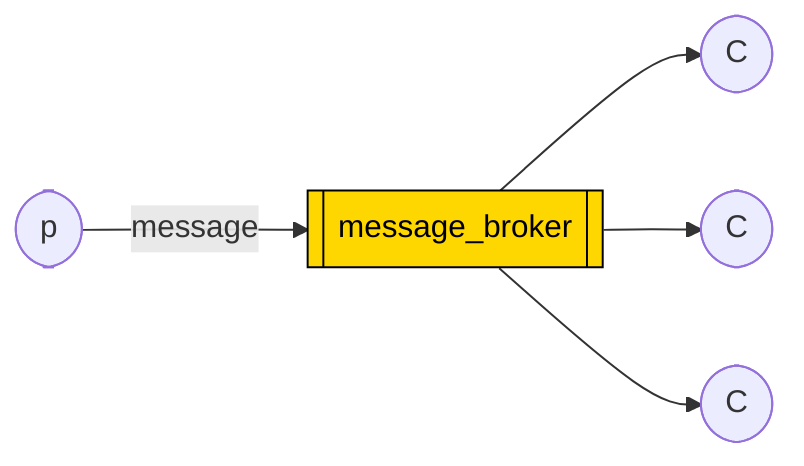
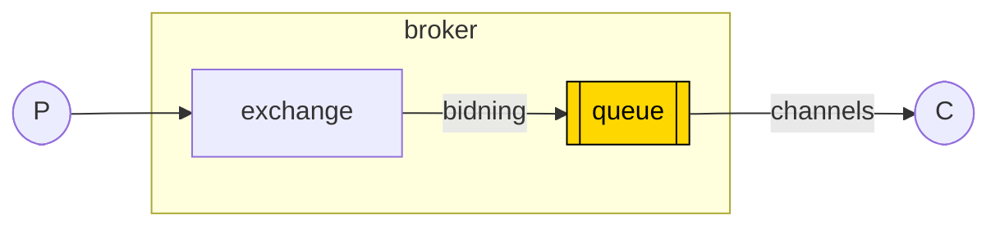

## what is broker ?

A message broker is **software that enables applications, systems and services to communicate with each other and exchange information**.

Message brokers can **validate, store, route, and deliver messages to the appropriate destinations**. They serve as intermediaries between other applications, allowing senders to issue messages without knowing where the receivers are, whether or not they are active, or how many of them there are.

The core idea in the messaging model in RabbitMQ is that the producer never sends any messages directly to a queue. Actually, quite often the producer doesn't even know if a message will be delivered to any queue at all.

